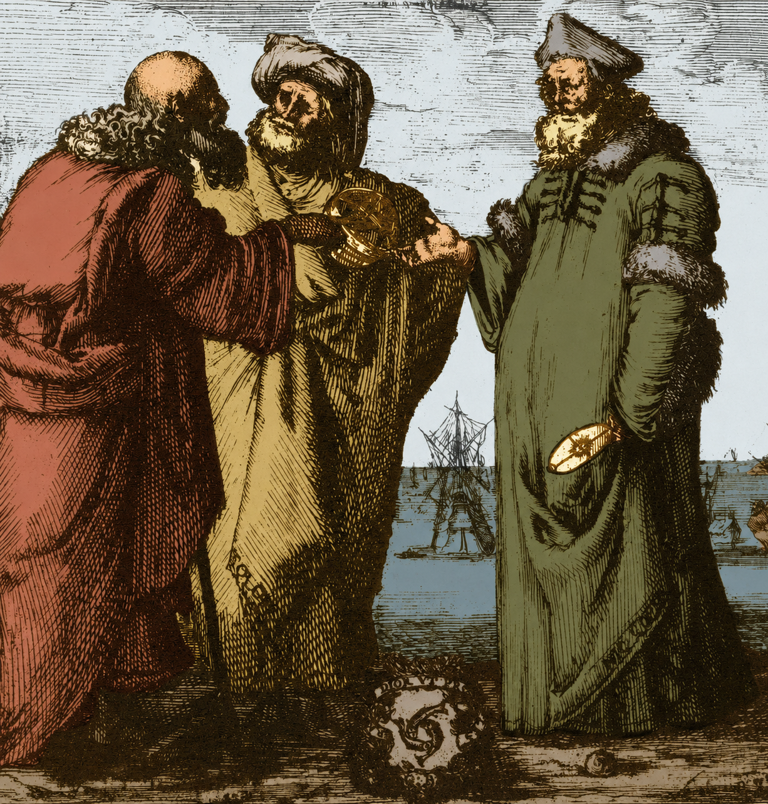
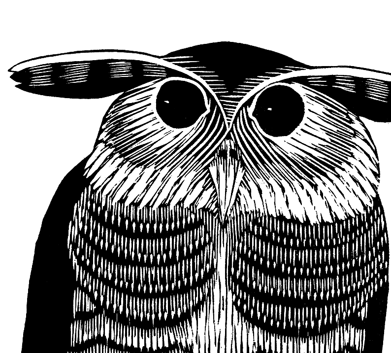
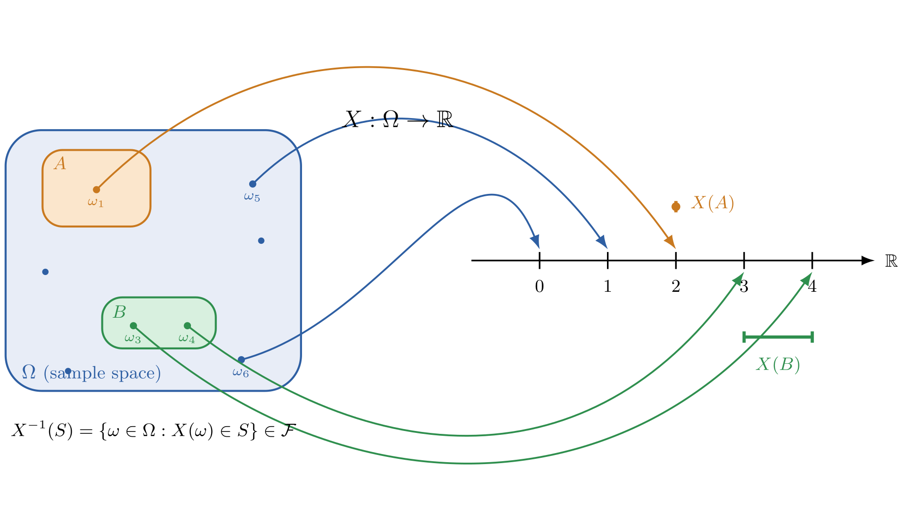
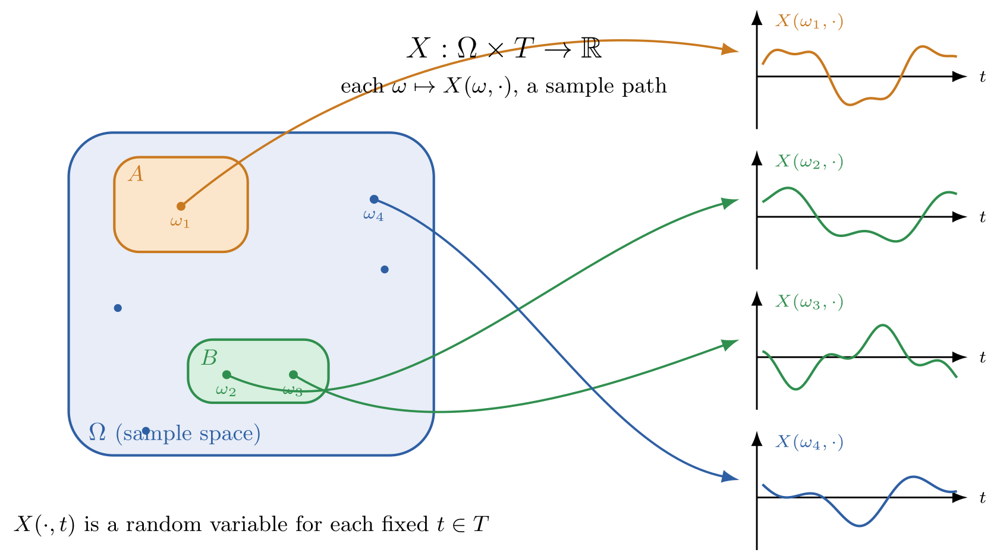
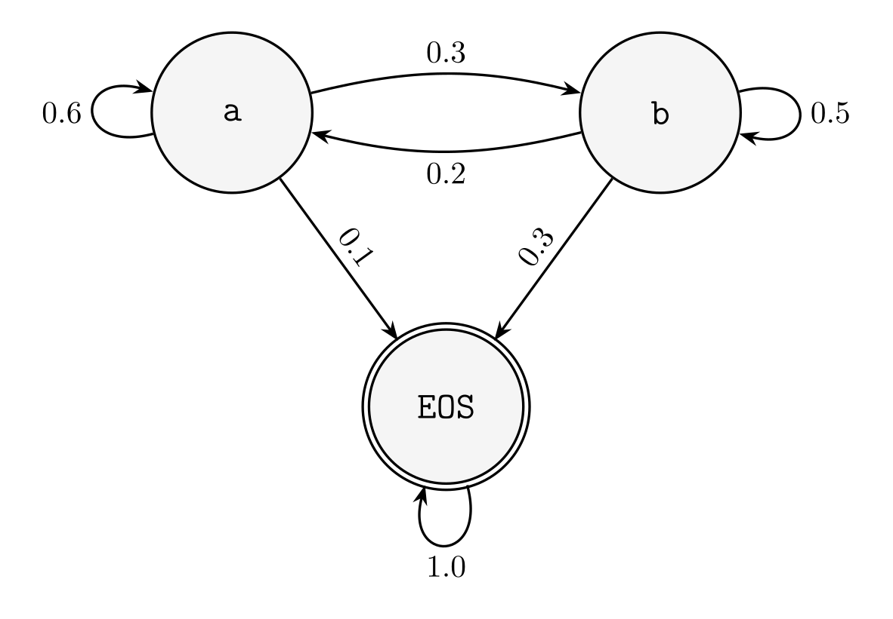
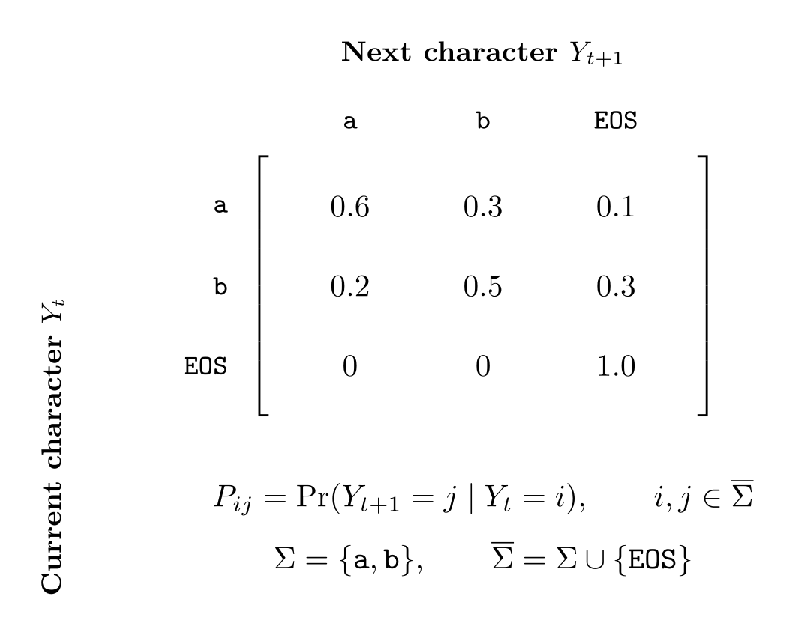

<small>*Frontispiece of Dialogue Concerning the Two Chief World Systems (Galileo Galilei 1632)*</small>

<div class="mobile-only">

> You are viewing this on a mobile device, but SITP is best viewed on a desktop — the book includes various multimedia lecture videos, visualizers, any tufte-style sidenotes with many external hyperlinks to other resources.

</div>

> We<span class="sidenote-number"></span><span class="sidenote">*A modified excerpt from The Structure and Interpretation of Computer Programs [§1: Building Abstractions with Procedures](https://mitp-content-server.mit.edu/books/content/sectbyfn/books_pres_0/6515/sicp.zip/full-text/book/book-Z-H-9.html#%_chap_1)*</span> are about to study the idea of a computational process. Computational processes are abstract beings that inhabit computers. As they evolve, processes manipulate other abstract things called data. The evolution of a process is directed by a pattern of ~~rules called a program~~ <a href="">*parameters called a model*</a>. People ~~create programs~~ <a href="">*train models*</a> to direct processes. In effect, we conjure the spirits of the computer with our spells.<br><br>
A computational process is indeed much like a sorcerer's idea of a spirit. It cannot be seen or touched. It is not composed of matter at all. However, it is very real. It can perform intellectual work. It can answer questions. It can affect the world by disbursing money at a bank or by controlling a robot arm in a factory. The ~~programs~~ <a href="">*models*</a> we use to conjure processes are like a sorcerer's spells. They are carefully ~~composed~~ <a href="">*recovered*</a> from ~~symbolic~~ <a href="">*numerical*</a> expressions in arcane and ~~esoteric~~ <a href="">*parallel*</a> programming languages that prescribe the ~~tasks~~ <a href="">*losses*</a> we want our processes to ~~perform~~ <a href="">*minimize*</a>.

# I. Elements of Networks<br>

<!--  -->

<br>

<div class="dropcap">

Although separated by over 2000 years, the programmers of Silicon Valley face a daunting task
quite similar to the one encountered by the mathematicians of Ancient Greece.
That is, to contribute towards this new approach of augmenting and amplifying human intelligence,
they must climb back down from their current pitch and backtrack to the beginner's mind they once had.

</div>

Not different from learning another mathematical or programming language, they must transition from
their *finitely discrete structures* and *deterministic procedures* tooling they have grown acustomed to
and make the transition to the *infintely continuous structures* and *stochastic procedures*.
Back then, ancient greek mathematicians were only comfortable with the finiteness of natural numbers like $1$, $2$, and $3$,
and had to grapple with the infinite nature of the real numbers such as $\sqrt{2}$, $\pi$, and $e$.
Similarly, the programmers of today are being asked to transition from programming algorithms of *sets, maps, lists, trees, and graphs*
to the distributions of *scalars, vectors, matrices, tensors, and neural networks*.

More coloquially, programmers interested in the deep learning approach to artificial intelligence must make the transition
from <span class="defnote">**software 1.0**</span>**software 1.0**
to <span class="defnote">**software 2.0**</span>**software 2.0**
<span class="sidenote-number"></span><span class="sidenote">*See [(Karpathy 2017)](https://karpathy.medium.com/software-2-0-a64152b37c35)*</span>,
a distinction used to differentiate the classical act of programming software line by line,
and the newer approach of programming software by specifying a dataset, a neural net architecture with a goal, and searching the space of programs with compute.
How to exactly program with this new approach will take the remainder of the book to explain.

While software 2.0 has increased the intelligence and autonomy of our devices throughout the past decade
— to name a few, language understanding with Google's Translate and Apple's Siri, vision understanding with Tesla Autopilot —
at the end of 2022 **ChatGPT** was released to the world marking the beginning
of <span class="defnote">**software 3.0**</span>**software 3.0**
<span class="sidenote-number"></span><span class="sidenote">*See [(Karpathy 2025)](https://www.youtube.com/watch?v=LCEmiRjPEtQ)*</span>,
enabling the activity of programming with none other than the English language.
What may be surprising to realize is that artificial intelligence like ChatGPT is "just" another computer program.
However, rather than being implemented in a language like C, Java, or Javascript, it's implemented in one that goes by the name of **PyTorch**,
a software 2.0 programming language centered around `torch.Tensor`, a multidimensional array humbly embedded within a Python package.

In this whimsical whirlwind tour dubbed **The Structure and Interpretation of Tensor Programs (SITP)**, we will embark on a quest to build from scratch
our own deep neural network like ChatGPT by implementing [`nanochat`](http://github.com/karpathy/nanochat)
and our own deep learning framework like PyTorch by implementing [`teenygrad`](https://github.com/j4orz/teenygrad).
Whether you're an eager high school student, an up coming college student, or a battle-tested industry programmer,
**SITP** has been meticulously designed so that the only prerequisite required
is a basic familiarity with the elements of programming, and high school calculus.
Any additional experience is helpful, not mandatory.

So with that all said, go on young hacker. Venture forth!<br>

<!-- If you'd like to start with the former, you are encouraged to consult
[§A](./ap.md#a-from-symbolic-software-10-to-stochastic-software-20) and [§B](./ap.md#b-from-greece-to-göttingen-and-finally-the-valley),
which historically retrace the transitions from symbolic software 1.0 to stochastic software 2.0 and from classical to constructive mathematics respectively. -->


## Table of Contents
<!-- 1. eigen value/singular value -->
<!-- 2. linear systems, least squares? -->
<!-- 3. BLAS -->

<div class="toc">

- [Overture: A Lean Snake and Parallel Crab](#overture-a-lean-snake-and-parallel-crab)
- [1. Sequence Learning](#1-sequence-learning)
  - [1.1 From Certain to Uncertain Knowledge](#11-from-certain-to-uncertain-knowledge)
  - [1.2 Counting Bigrams](#12-recovering-the-distribution-of-language)
  - [1.3 Iteratively Fitting Logistic Regression](#15-iteratively-fitting-logistic-regression-with-cross-entropy-loss) <!-- logistic reg/1 layer ffn -->
  - [1.4 Directly Fitting Linear Regression](#16-directly-fitting-linear-regression-with-least-squared-error) <!-- with least squared error -->
  - [1.5 Generalized Linear Models](#16-directly-fitting-linear-regression-with-least-squared-error) <!-- with least squared error -->
  - [1.6 Summary](#17-summary)
  - [1.7 Bibliographic Notes](#18-bibliographic-notes)
  - [1.8 Problems](#19-problems)
- [Intermezzo One: The Language of Probability and Linear Algebra](#intermezzo-one-the-language-of-probability-theory-and-linear-algebra)
  - [I1.1 Probability Spaces](#i11-probability-spaces)
  - [I1.2 Random Variables and their Distributions](#i12-random-variables-and-their-distributions)
  - [I1.3 Random Processes and their Kernels]()
  - [I1.4 Language Models as Random Processes]()
  - [I1.5 Language Models as Random Variables]()
  - [I1.6 Vector Spaces]()
  - [I1.7 Bibliographic Notes]()
- [2. The Tensor](#2-from-ipls-array-to-apls-multidimensional-array)
  - [2.1 Virtualizing Shapes with Strides](#21-from-virtual-to-physical-machines-and-shapes) <!-- three language problem: rust translation and risc-v evaluation -->
  - [2.2 Accelerating the Communication of Hierarchies]()
  - [2.3 Accelerating the Computation of Pipelines]()
  - [2.4 From Abstract to Numerical Linear Algebra]()
  - [2.6 Summary](#26-summary)
  - [2.7 Bibliographic Notes](#27-bibliographic-notes)
  - [2.8 Problems](#28-problems)
- [Intermezzo Two: The Language of Numerical Analysis]()

</div>

<!-- - [1.7 Matrix Factorizations: Eigenvalues, Singular Values, and their Decompositions]()
  - [1.8 Learning Subspaces with Principal Component Analysis via Maximum Variance]() -->
  <!-- - [2.2 Predicting Scalars by Linearly Modeling Regression]() $f: \reals^d \to \reals$
  - [2.3 Directly Fitting Linear Regression with Squared Error Loss](#) $\mathscr{L(\theta)} := $ -->

## Overture: A Lean Snake and Parallel Crab

> In which we introduce and motivate the programming languages used throughout the book, including Lean, Python, Rust, and CUDA Rust.

<!-- >Dependent type theory<span class="sidenote-number"></span><span class="sidenote">*Harper's forward to (Friedman and Christiansen 2018)'s [https://thelittletyper.com/](https://thelittletyper.com/)*</span> (...) is a wonderfully beguiling, and astonishingly effective, unification of mathematics and programming. In type theory when you prove a theorem you are writing a program to meet a specification-and you can even run it when you are done! A proof of the fundamental theorem of arithmetic amounts to a program for factoring numbers. And it works the other way as well: every program is a proof that its specification is sensible enough to be implementable. Typе theory is a hacker's paradise.

> Everything is vague to a degree you do not realize till you have tried to make it precise. -->

<br>

<div class="dropcap">

The Structure and Interpretation of Tensor Programs is very much a whimsical whirlwind wonderland tour<span class="sidenote-number"></span><span class="sidenote">*See [http://www.literateprogramming.com/](http://www.literateprogramming.com/)*</span> to the world of deep learning and deep learning systems.
And part of what makes a whirlwind tour so whimsical and wonderful is the mystery of adventure,
but due to the breadth of which the SITP book covers, we briefly explain how the show is about to unfold.
That is, a "how to read this book" if you will, explaining how concepts will be presented and explained.

</div>

The primary story this book tells is the one of how *intertwined* the activities of mathematics and programming are
with respect to the discipline of deep learning. That is, the performance of the systems in which neural networks are trained
on affect bottom line quality as much as their architectures.
As a first approximation, you can conceptualize deep learning frameworks like `torch` and `jax`
as Python packages that provide *accelerated, mathematical* primitives of statistical distributions, high dimensional arrays, and optimizers from probability theory, linear algebra, and calculus.

In SITP however, you will be using a framework called `teenygrad`, which you can roughly think of a minimal, hackable subset that avoids the complexity and cost that the more industrial frameworks
offer<span class="sidenote-number"></span><span class="sidenote">*After our journey together, you can take a look at the [Afterword](./after.md)
which explains the primary differences between such frameworks, thus bridging you from `teenygrad` to `torch` and `jax`.*</span>.
In addition, not only will you be *using* `teenygrad` but also *implementing* your very own.
By the end of the book, you will have a working implementation of `teenygrad` capable of running distributed training and inference for `nanochat`,
which you are encouraged to modify, extend, and hack on thereafter.
This is effectively the primary purpose of this book: for you to learn deep learning and deep learning *systems* in one unified treatment,
which brings us to our next order of business: presenting the show's cast with a playbill, or in other words, the map of the territory.

In order to provide accelerated mathematical primitives, deep learning frameworks (including `teenygrad`) are implemented with a variety of programming languages.
For `teenygrad` specifically, we will be using *four*, namely that of the Lean, Python, Rust, and CUDA Rust programming languages.
Such languages are referred to as host languages because they are *used* to implement the `teenygrad` deep learning language.
We briefly motivate each language, explain the order in which they will be presented,
suggest possible reading "passes" to iteratively and incrementally deepen your use of each language, and provide alternatives.

First, Python is of course used because that is the primary programming language in which artificial intelligence community conducts its research in,
and for good reason. It's an extremely productive one, especially for researchers who might be not as well versed in the dark arts of casting spells upon the computer.
The first contact of any mathematical concept will be an intuitive and informal one, *using* `teenygrad` in Python in order to carry out a computation.
Then, the second contact is in between chapters with Intermezzos, which formalize those very same concepts using dependent types provided by the interactive proof assistant `Lean`.
These intermezzos can optionally be skipped upon a first reading.
However, each successive chapter will assume and make use of the formalized concepts within each Intermezzo therein.

The third and fourth contact of a given mathematical concept are in tandem, which involves *implementing* `teenygrad` in a mix
of the Python, Rust, and CUDA Rust programming languages. Systems programming languages like Rust and CUDA Rust
are used in order to provide native acceleration of multi and massively parallel processors like CPUs and GPUs.
For each mathematical concept, a slower version will be implemented with a mix of Python and Rust, and a faster version will be implemented with CUDA Rust.

If you find yourself more mathematically oriented and disinterested in the high performance computing and performance engineering of such mathematical primitives,
you can skip any sections with CUDA Rust, and implement the sections using Rust with Python.
If you find yourself inclined in such peformance engineering but are not interested in learning the Rust and CUDA Rust programming languages, you can follow along with C/C++ and CUDA C/C++, although the primary difference not much, given that Rust's ownership is simply formalizing many of the language features of C++11 with linear types.
If you find yourself interested in the performance engineering but disinterested in both Rust and C++, you can use CUDA Python.

We surface all this complexity now because we trust you to make the right decision for yourself.
If you want to follow along with a pure Haskell implementation, go for it.
Take charge of your own education, as ultimately you are the captain of your own ship.
This is no different to professors and authors that offer courses and textbooks on compiler construction
provide the freedom for learners to choose the host language you will use for your compiler
— they are assuming that what is new to you is not the host language, but the principles of compiler construction itself.
Similarly, this book is emphatically not about teaching any of the aforementioned four languages, but rather the principles of deep learning and deep learning systems.
That is, these various programming languages are the *means* of SITP rather than the *end*.

With that being said, we briefly provide a unified introduction the three programming languages of Lean, Python, and Rust together so you can compare and contrast with the foundation you already have as a programmer
in [§A. From Problems to Proof](./ap.md#a-from-problems-to-proof),
which constructs various number systems along with some elementary proofs.

With that said, down the rabbit hole we go.

<!-- This sets a very high standard: every rule of inference and every step of a calculation has to be justified by appealing to prior definitions and theorems, all the way down to basic axioms and rules. -->

## 1. Sequence Learning <!-- $p(X=x)$ from $D=\{x^{(i)}\}_{i=1}^{n}$ -->
<small>[$\hookleftarrow$ Table of Contents](#table-of-contents)</small>

> In which we transition to the stochastic and infinitely continuous software 2.0 with ngram and linear models using probabiltiy theory, linear algebra, and calculus.

### 1.1 From Certain to Uncertain Knowledge
<small>[$\hookleftarrow$ Table of Contents](#table-of-contents)</small>

<!-- Because of how pervasive large language models have become over the past few years,
many people are familiar with the ideas that large language models are next token predictors
in the same way that digital computers speak 0s and 1s,
the internet is an intergalactic highway,
and the cloud is some cloud in the computer, -->

<br>

<div class="dropcap">

The gifts that information revolution brought forth to humanity, at their essence, have simple explanations.
As a first approximation, the digital computer can be described as 0s and 1s,
the intergalactic computer network as an information highway,
and the cloud as computers in the sky.
The same can be said for those that the intelligence revolution is currently bringing in.
Assistants can be described as llms trained with thumbs up or thumbs down,
reasoners as producing chains of thought,
and agents as models that have access to a command line.
This magic is continuing to grow  as people are even composing agents together into swarms
but the key technology that underlies everything is the large language model,
which itself, can be simply explained as a next token predictor.
That is, given some user prompt as input,
it generates an answer by repeatedly producing a probability distribution over the next word,
sampling a word, and appending such word to the input.

</div>

Although ChatGPT, Claude and friends are relatively new,
the idea of generating sentences with next token prediction is surprisingly not new
and dates back to the work of Russian mathematician Andrey Andreyevich Markov in 1913,
and shortly after Claude Shannon in
1948<span class="sidenote-number"></span><span class="sidenote">*Will the real Claude please stand up?*</span>.
So why is humanity's so-called tech tree late to such technology?
It's predominantly because of the fossil-fuel like <span class="defnote">**data**</span>**data** subsidy provided by the aforementioned
intergalactic computer network we call the web,
the <span class="defnote">**compute**</span>**compute** provided by massively parallel processors originally designed for graphics
we call graphic processing units (henceforth GPUs),
which can be used efficiently by a neural network <span class="defnote">**architecture**</span>**architecture** called attention.
This is why ChatGPT Claude are called <span class="defnote">**large language model**</span>**large language models**.

<br>

<div class="full-bleed">
<iframe height="500px" loading="lazy" src="https://www.youtube.com/embed/LPZh9BOjkQs?si=FAZSTr1_zkFeSuOf"  title="YouTube video player" frameborder="0" allow="accelerometer; autoplay; clipboard-write; encrypted-media; gyroscope; picture-in-picture; web-share" referrerpolicy="strict-origin-when-cross-origin" allowfullscreen></iframe>
</div>

<small>*Large Language Models explained briefly (Grant Sanderson, 3Blue1Brown 2024)*</small>

<br>

Large language models are trained using methods from the discipline of <span class="defnote">**deep learning**</span>**deep learning**,
which in turn, are based in the statistical <span class="defnote">**machine learning**</span>**machine learning** approach to artificial intelligence.
This means, in order to produce such a probability distribution over possible next words,
ChatGPT, Claude and others use a lot of mathematical machinery from
the areas of probability theory (clearly), linear algebra, and calculus.
We will introduce such mathematical primitives by keeping our language models simple at first
in [Part I. Elements of Networks](./1.md) — namely what is called the ngram model and linear models
in which the aforementioned Markov and Shannon were working on around a century ago —
before diving into the design of neural network architectures (including transformers with the attention operator) in [Part II. Deep Neural Networks](./2.md).

> [!NOTE]
>  If you'd like a more historical and philosophical approach
in how the logical and finitely discrete techniques of software 1.0 failed to build
such conversational machines, you are encouraged to reference [§B. From Symbolic Software 1.0 to Stochastic Software 2.0](./ap.md#b-from-symbolic-software-10-to-stochastic-software-20),
which covers early systems from classical computational linguistics and natural language processing. Namely, `ELIZA`, `LUNAR`, and `CYC`. <br style="clear: both;">

<div id="gpt2-widget" style="
  font-family: var(--mono-font, 'Source Code Pro', monospace);
  font-size: 0.85em;
  background: var(--quote-bg);
  border-radius: 6px;
  padding: 1rem;
  margin: 1.5rem 0;
">
  <div style="opacity:0.5;font-size:0.8em;margin-bottom:0.5rem;user-select:none;">GPT-2 2019 · next-token probabilities · runs in your browser</div>
  <form id="gpt2-form" style="display: flex; gap: 0.5rem;">
    <input id="gpt2-input" type="text" autocomplete="off" value="Hello nice to" placeholder="type a prefix…" style="
      flex: 1;
      min-width: 0;
      background: var(--bg);
      color: var(--fg);
      border: 1px solid var(--quote-border, #444);
      border-radius: 4px;
      padding: 0.4rem 0.6rem;
      font: inherit;
      outline: none;
    ">
    <button type="submit" style="
      background: var(--quote-bg);
      color: var(--fg);
      border: 1px solid var(--quote-border, #444);
      border-radius: 4px;
      padding: 0.4rem 0.8rem;
      font: inherit;
      cursor: pointer;
    ">predict</button>
  </form>
  <div id="gpt2-status" style="opacity:0.5;font-size:0.8em;margin:0.6rem 0;">press predict — GPT-2 (~250 MB) downloads on first use, then runs locally</div>
  <div id="gpt2-out"></div>
</div>
<script type="module" src="assets/gpt2/gpt2-widget.js"></script>

Consider the partial sentence "Hello nice to"
and feed it into GPT-2 with the words "meet you" missing. When you click the predict button,
GPT-2 produces a list of real numbers represented by floating points
that are between 0 and 1 and sum (or normalize) to 1,
which is called a <span class="defnote">**distribution**</span>**distribution**.
Each number represents
the <span class="defnote">**probability**</span>**probability**, <span class="defnote">**chance**</span>**chance**, <span class="defnote">**likelihood**</span>**likelihood**, or <span class="defnote">**belief**</span>**belief**
that GPT-2 *assigns* to the next word. But rather than
produce a distribution with two outcomes like a coin,
six outcomes like a die, or fifty two outcomes like cards,
it produces one for $|V|$ outcomes, where $V$ is the set of words in some vocabulary.
The size of GPT-2's vocabulary is 50257, and the list of probabilities you see
above are the top 10 most likely.
As a first approximation, it's not incorrect to conceptualize large language models
as an urn containing a ball labeled with each word in the vocabulary.
However, it's important to note in the case of language that some balls are weighted heavier than others.
To be more precise, because we are passing an input sentence,
such a distribution is a <span class="defnote">**conditional distribution**</span>**conditional distribution**. That is, GPT-2 is producing the distribution of the next word given, or conditioned on,
the sequence of words passed in as input, and is denoted by

$p(w\underbrace{\mid}_{\text{given}}\text{input sentence})$

and in the example above, you are asking GPT-2 to produce $p(w\mid \text{Hello nice to})$.
We can print the conditional distribution that GPT-2 outputs, and verify that
1. each probability corresponding to a token on a per-index basis is between $0$ and $1$
2. the distribution normalizes to $1$

```python
import numpy as np

# The same GPT-2 output distribution p(w | "Hello nice to") from above, top 10 of 50257 words
tokens = [" see", " meet", " hear", " have", " be", " know", " you", " talk", " say", " get"]
condprobs = np.array([0.3169, 0.1268, 0.1246, 0.1046, 0.0471, 0.0352, 0.0320, 0.0128, 0.0114, 0.0067])
for i in np.argsort(-condprobs):
    print(f"{tokens[i]} : {condprobs[i]:.4f}")

print("Asking GPT-2 what is p(w|Hello nice to):")
print(f"Total sum of p(w|Hello nice to): {condprobs.sum():.4f}")
```

Well, since we are only printing the top 10 most likely words out of $50256$, the total sum is in fact $0.8181$,
with $1-0.8181=0.1819$ spread amongst the other $50256-10=50246$ words. You may have also noticed
that the output distribution is not a regular array, but rather one constructed with [`np.array`](https://numpy.org/doc/stable/reference/generated/numpy.array.html#numpy.array). What is being constructed it an an [`np.ndarray`](https://numpy.org/doc/stable/reference/generated/numpy.ndarray.html), which is a <span class="defnote">**multidimensional array**</span>**multidimensional array**.
A multidimensional array is what it says on the tin can, and is an array with multiple dimensions.
The two key properties of an `ndarray` are the
[`ndarray.shape`](https://numpy.org/doc/stable/reference/generated/numpy.shape.html#numpy.shape),
and [`ndarray.dtype`](https://numpy.org/doc/stable/reference/generated/numpy.ndarray.dtype.html),
which denote the length of each nested level of the entire array, and the floating point precision of the values.

```python
import numpy as np

# The same GPT-2 output distribution p(w | "Hello nice to") from above, top 10 of 50257 words
tokens = ["see", " meet", " hear", " have", " be", " know", " you", " talk", " say", " get"]
condprobs = np.array([0.3169, 0.1268, 0.1246, 0.1046, 0.0471, 0.0352, 0.0320, 0.0128, 0.0114, 0.0067])

print(f"type(condprobs)")
print(f"condprobs.shape: {condprobs.shape}, {type(condprobs.shape)}")
print(f"condprobs.dtype: {condprobs.dtype}, {type(condprobs.dtype)}")
```

So the conditional distribution that GPT-2 outputs has a shape of $(10,)$ whose floating point values have
double precision<span class="sidenote-number"></span><span class="sidenote">*See [https://en.wikipedia.org/wiki/Double-precision_floating-point_format](https://en.wikipedia.org/wiki/Double-precision_floating-point_format)*</span>.
Because this `np.ndarray` is simply a flat list with 10 values, it's considered an array with 1 dimension.
The dimension is simply the `len(ndarray.shape)`, and `numpy` conveniently provides it with `ndarray.ndim`.

```python,highlight={9}
import numpy as np

# The same GPT-2 output distribution p(w | "Hello nice to") from above, top 10 of 50257 words
tokens = ["see", " meet", " hear", " have", " be", " know", " you", " talk", " say", " get"]
condprobs = np.array([0.3169, 0.1268, 0.1246, 0.1046, 0.0471, 0.0352, 0.0320, 0.0128, 0.0114, 0.0067])

print(f"type(condprobs)")
print(f"condprobs.shape: {condprobs.shape}, {type(condprobs.shape)}")
print(f"condprobs.ndim: {condprobs.ndim}, {type(condprobs.ndim)}")
print(f"condprobs.dtype: {condprobs.dtype}, {type(condprobs.dtype)}")
```

We will learn much more about the `np.ndarray` in due time, but for now, we simply use it as container for
GPT-2's output conditional distribution.

> [!IMPORTANT]
>  A probability distribution is a list of numbers between 0 and 1 that normalize (sum) to 1. Intuitively speaking, a first approximation to probability can be conceptualized  *as* array programming. <br style="clear: both;">

So when you ask an LLM a question, it generates a full answer (with many sentences)
word by word by repeating the following loop:

1. evaluating the probability of the next word conditioned on the input
2. selecting (or sampling) a word. halt if the word is the special END word.
3. appending it to the existing text, and evaluating the probability again with the modified input

Now that you understand the basics of language modeling, the trillion dollar question
is how to produce such a conditional distribution $p(w\mid \text{input sentence})$?
In some sense that's all there is to large language models.

### 1.2 Recovering the distribution of language
<small>[$\hookleftarrow$ Table of Contents](#table-of-contents)</small>

- introduce random variables in prev section? $p(W_t=w_t\mid W_1=w1, \cdot W_{t-1}=w_{t-1})$
- definition of conditional, derive chain rule (decomposing joint as a product of conditional probabilities cotterell theorem)
  - eisenstein "still intractable"
  - estimate full conditionals by counting relative frequencies of truncated conditional (markov assumption)
    - MLE estimate

a bigram character-level language model adapted from karpathy<span class="sidenote-number"></span><span class="sidenote">*syllabus: https://karpathy.ai/zero-to-hero.html, lecture: https://www.youtube.com/watch?v=PaCmpygFfXo, notebook: https://github.com/karpathy/nn-zero-to-hero/blob/master/lectures/makemore/makemore_part1_bigrams.ipynb, makemore: https://github.com/karpathy/makemore/blob/master/makemore.py#L399*</span>

```python
{{#include ../../examples/4.1-makemore-ngram-np.py}}
```

<!-- ```python
{{#include ../../examples/4.1-makemore-ngram-np.py:1:13}}
```

foobarbaz

```python
{{#include ../../examples/4.1-makemore-ngram-np.py:16:49}}
```

foobarbaz

```python
{{#include ../../examples/4.1-makemore-ngram-np.py:53:}}
``` -->


> [!IMPORTANT]
>  we don't enumerate through the entire sample space nor event space,
that would run into similar issues of describing a reality with too many parts to count.
we need random variables. <br style="clear: both;">

### 1.3 From Variables to Random Variables
<small>[$\hookleftarrow$ Table of Contents](#table-of-contents)</small>

<!-- random variables -->
- definitions of rvs using calculus/analysis
- bernouilli an n=1 binomial)
- categorical (an n=1 multinomial)

### 1.4 The Inference of Parameter Estimation
<small>[$\hookleftarrow$ Table of Contents](#table-of-contents)</small>


<!-- maximum likelihood estimation for bernouilli (binomial), categorial (multinomial) -->
<!-- empirical risk minimization -->
<!-- maximum a posteriori -->

<!-- karpathy/markov/shannon ngrams?? (starting off with simplest model. 1 layer FFN (logistic regression in chapter 2)?? -->

### 1.5 Iteratively Fitting Logistic Regression with Cross Entropy Loss <!-- $\mathscr{L(\theta)} := $ -->
<small>[$\hookleftarrow$ Table of Contents](#table-of-contents)</small>

```python
{{#include ../../examples/4.2-makemore-ffn1layer-torch.py}}
```

### 1.6 Directly Fitting Linear Regression with Least Squared Error
<small>[$\hookleftarrow$ Table of Contents](#table-of-contents)</small>

### 1.7 Summary
<small>[$\hookleftarrow$ Table of Contents](#table-of-contents)</small>


### 1.8 Bibliographic Notes
<small>[$\hookleftarrow$ Table of Contents](#table-of-contents)</small>

The primary texts consulted in the writing of this chapter were
[(Jurafsky and Martin 2026)](),
[(Eisenstein 2018)](),
[(Manning 2001)](),
and [(Cotterell 2024)]()
for statistical natural language processing;
[(Hastie, Tibshirani, and Friedman 2009)](https://hastie.su.domains/ElemStatLearn/),
and [(Murphy 2022)](https://probml.github.io/pml-book/book1.html)
for machine learning more generally.

### 1.9 Problems
<small>[$\hookleftarrow$ Table of Contents](#table-of-contents)</small>

{{#quiz ../quizzes/test.toml}}

<!-- {{#quiz ../quizzes/test2.toml}}

{{#quiz ../quizzes/test3.toml}} -->


## Intermezzo One: The Language of Probability Theory and Linear Algebra
<small>[$\hookleftarrow$ Table of Contents](#table-of-contents)</small>

As you now know from [§1. Sequence Learning](#1-sequence-learning), language models are next token predictors.
Whether these language models are bigram models, logistic regression models, or the GPT-2 like neural nets that we will see in
[Part II. Deep Neural Networks](./2.md),
they are all functions that produce an output distribution over the next word given some input sentence as the history.
That is, they are functions of type $f: \Sigma^{*} \to \Delta^{|\Sigma|}$
Before we dive into the internals of [`teenygrad`](https://github.com/j4orz/ateenysitp) itself in [§2. The Tensor](#2-from-ipls-array-to-apls-multidimensional-array) and implement our own framework capable of training the bigram and logistic regression models,
we will formally characterize our language model implementations from §1 using the language of probability, linear algebra, and calculus.
The one text which was heavily consulted over others was [Formal Aspects to Language Modelling (Cotterell et al., 2024)](https://arxiv.org/abs/2311.04329).
If you'd like spend some time formalizing an area that may be even more familiar with you (namely the number systems $\N, \Z, \reals$),
please consult [§A. From Problems to Proof](./ap.md#a-from-problems-to-proof).

<div class="toc">

- [Intermezzo One: The Language of Probability]()
  - [I1.1 Probability Spaces](#i11-probability-spaces)
  - [I1.2 Random Variables and their Distributions](#i12-random-variables-and-their-distributions)
  - [I1.3 Random Processes and their Kernels](#i13-random-processes-and-their-kernels)
  - [I1.4 Language Models as Random Processes](#i14-language-models-as-random-processes)
  - [I1.5 Language Models as Random Variables](#i15-language-models-as-random-variables)
  - [I1.6 Vector Spaces](#i16-vector-spaces)
  - [I1.7 Bibliographic Notes](#i17-bibliographic-notes)
</div>

### I1.1 Probability Spaces
<small>[$\hookleftarrow$ Table of Contents (Intermezzo One)](#intermezzo-one-the-language-of-probability-theory-and-linear-algebra)</small>

Informally speaking, you intuitively understand the notion of a probability and a probability distribution.
That is, a probability is a number between 0 and 1 that represents the chance, likelihood, or belief of some event happening,
and a distribution is a list of such numbers.
Probability distributions come *from* the concept of **probability spaces**,
so before defining the former we must define the latter, which are **measures of the size of sets**.


<small>Figure I1.1</small>

Figure I1.1 is comprised of three components. Namely, the blue box and it's blue dots, the colored boxes, and the mapping from the colored boxes to the $[0,1]$ number line
1. the sample space $\Omega$: the set of all possible outcomes in an experiment
2. the event space $\mathcal{F}$: the set of all subsets in the sample space
3. probability law $\mathbb{P}$: a mapping from the event space to a number between 0 and 1

Conceptually speaking, the language models we've seen in [§1. Sequence Learning](#1-sequence-learning)
such as GPT-2, the bigram model, and the logistic regression model which have type $f: \Sigma^* \to \Delta^{|\Sigma|}$
produce (on a *single evaluation*) concrete probability distributions with `np.ndarray`
that come *from*
mathematically abstract probability spaces $(\Omega, \mathcal{F}, \mathbb{P})$
where the sample space $\Omega$ is the set *of words* in their vocabulary,
and their belief in a word occuring is represented by probability law $\mathbb{P}$ defined on event space $\mathcal{F}$.

> [!CAUTION]
>  Probability spaces are usually NOT implemented with code. For instance, GPT-2, bigram models, and logistic regression models do NOT instantiate and return Python `set()`s for the sample space $\Omega$, the event space $\mathcal{F}$, nor define some function `def probability_law(event_space: set) -> float` for $\mathbb{P}$. They return a probability distributions, which we define in [§I1.2 Random Variables and their Distributions](#i12-random-variables-and-their-distributions). Rather, the purpose of probability spaces as a mathematical definition is conceptual clarity with  general definitions<span class="sidenote-number"></span><span class="sidenote">*Defining concepts without commiting to internal structure allows for a much broader class of objects to be considered. This is very much like type polymorphism (generics, traits, type classes), except the generality of mathematical concepts are usually "more" general than those that might be implemented with type polymorphism. For instance, this abstract definition of a probability space is generalized to cover any random experiment we'd like to model, from rolling dice, to generating language. However it's quite unusual to have a program need to progam both.*</span> and rigorous results with theorems.

Let us now precisely define each component of a probability space $(\Omega, \mathcal{F}, \mathbb{P})$,
starting with the sample space $\Omega$.

<div class="definition" data-title="Definition: Sample Space">

A **sample space** is the set of all possible outcomes in an experiment denoted by $\Omega$ ($\LaTeX$ code: `\Omega`).

</div>

<div class="example" data-title="Example 1.1: Gambling Sample Spaces">

- Consider flipping a coin. Then $\Omega := \{\text{H}, \text{T}\}$.
- Consider playing rock, paper, scissors. Then $\Omega := \{🪨, 📄, ✂ \}$.
- Consider rolling a die. Then $\Omega := \{⚀,⚁,⚂,⚃,⚄,⚅\}$.
- Consider drawing a card. Then $\Omega := \{ \\
  🂡,🂢,🂣,🂤,🂥,🂦,🂧,🂨,🂩,🂪,🂫,🂭,🂮, \\
  🂱,🂲,🂳,🂴,🂵,🂶,🂷,🂸,🂹,🂺,🂻,🂽,🂾, \\
  🃁,🃂,🃃,🃄,🃅,🃆,🃇,🃈,🃉,🃊,🃋,🃍,🃎, \\
  🃑,🃒,🃓,🃔,🃕,🃖,🃗,🃘,🃙,🃚,🃛,🃝,🃞 \\
  \}$.

</div>

<div class="example" data-title="Example 1.2 : Language Sample Space">

Consider generating a word from this very sentence.
Then, $\Omega := \{\text{a}, \text{consider}, \text{from}, \text{generating}, \text{this}, \text{sentence}, \text{very}, \text{word}\}$

</div>

So conceptually speaking, language models like GPT2, the bigram model, and the logistic regression model
of type $f: \Sigma^* \to \Delta^{|\Sigma|}$
which produce concrete distributions with `np.ndarray` on a *single* evaluation come from
mathematically abstract probability spaces $(\Omega, \mathcal{F}, \mathbb{P})$ where the sample space $\Omega$ is the set *of words* in their vocabulary,
and their belief in a word occuring is represented by probability law $\mathbb{P}$ defined on event space $\mathcal{F}$.

> [!IMPORTANT]
>  Notice how we have NOT said anything about *multiple* evaluations of a language model's output distribution (and probability space) over *words* to generate a complete sentence (in the probablity space of sentences). We will see how they relate soon.  <br style="clear: both;">

<div class="definition" data-title="Definition: Event Space">

An **event space** is the set of all possible subsets of the sample space denoted by $\mathcal{F}$ ($\LaTeX$ code: `\mathcal{F}`).

</div>

<div class="example" data-title="Example: Event Space">

</div>

TODO: something to say here about event spaces? cardinality of them?


<div class="definition" data-title="Definition: Probability Law">

A **probability law** is a function $\mathbb{P}: \mathcal{F} \to [0,1]$ that sends an event to a number between 0 and 1.

</div>

<div class="example" data-title="Example: Probability Law">

Consider flipping a coin. Then we model the experiment with sample space $\Omega:= \{\text{H}, \text{T}\}$, event space $\mathcal{F}:= \{\emptyset, \{\text{H}\}, \{\text{T}\}, \Omega \}$, and probability law

$$
\begin{aligned}
\mathbb{P}: \mathcal{F} \to [0,1] \\
\mathbb{P}(\emptyset)=1, \mathbb{P}(\text{H})=\frac{1}{2}, \mathbb{P}(\text{T})=\frac{1}{2}, \mathbb{P}(\Omega)=1
\end{aligned}
$$

</div>

> [!WARNING]
>  Why is the probability law $\mathbb{P}$ defined as a function on the event space $\mathcal{F}$ rather than the sample space $\mathcal{\Omega}$? Pause and think! Hint: Would something bad happen if we did such a thing? <br style="clear: both;">

<div class="definition" data-title="Definition: Probability Law Redefined">

A **probability law** is a function $\mathbb{P}: \mathcal{F} \to [0,1]$ that sends an event to a number between 0 and 1, satisfying three axioms:
<ol type="I">
<li><em>non-negativity</em>: $\mathbb{P({E})} \geq 0$</li>
<li><em>normalization</em>: $\mathbb{P(\Omega)}=1$</li>
<li><em>additivity</em>: $A \cap B = \emptyset \implies \mathbb{P}(A\cup B) = \mathbb{P}(A)+\mathbb{P}(B)$</li>
</ol>

</div>

<div style="display: flex; justify-content: space-between; align-items: center; gap: 1em; flex-wrap: wrap;">


</div>

$$
\begin{aligned}
\mathbb{P}(\{\text{banana}, \text{bongo}\}) &= \mathbb{P}(\{\text{banana}\} \cup \{\text{bongo}\}) \\
                                            &= \mathbb{P}(\{\text{banana}\}) + \mathbb{P}(\{\text{bongo}\})
                                            && \text{[by additivity]}\\
&= 0.1 + 0.2 \\
&= 0.3
\end{aligned}
$$

However the event $C$ which contains all foobarbaz is composed of overlapping events
(corresponding to the right figure above), so the axiom of addivitiy does not apply.
We can evaluate the union of non-disjoint (overlapping) events with the following corollary,
known as the <span class="defnote defnote--prop">**sum rule**</span>**sum rule**:

$$
\mathbb{P}(A\cup B) = \mathbb{P}(A)+\mathbb{P}(B)- \mathbb{P}(A \cap B)
$$

We have now sharpened our intuition notion of **chance**, **belief**, and **probability** by formally defining them
**as the measure of the size of sets**. These sets have a home, and the measure has a domain,
namely the sample space $\Omega$ and the event space $\mathcal{F}$ which together with the probability law $\mathbb{P}$,
comprise the definition of a probability space $(\Omega, \mathcal{F}, \mathbb{P})$, albeit abstractly so.
Let us now connnect this mathematically abstract space to the more concrete probability distributions
we used in [§1. Sequence Learning](#1-sequence-learning).

### I1.2 Random Variables and their Distributions

<small>[$\hookleftarrow$ Table of Contents (Intermezzo One)](#intermezzo-one-the-language-of-probability-theory-and-linear-algebra)</small>

Probability distributions are the practical and concrete `np.ndarray` objects we used throughout [§1. Sequence Learning](#1-sequence-learning)
when implementing the bigram and logistic regression language models.
So how do these connect to the abstract concept of probability spaces just defined?
The answer is with:
1. **random variables**: functions that map outcomes in the sample space to states on the real number line and their
2. **probability mass functions**: functions that map such real-numbered states to their probabilities



<small>Figure I1.2</small>

(todo modify picture or include another picture to show distribution (probality assignment of variable taking on state))


Figure I1.2 shows the same sample space $\Omega$ and event space $\mathcal{F}$ from [§I1.1 Probability Spaces](#i11-probability-spaces), but rather than evaluate probabilities with the probability law $\mathbb{P}: \mathcal{F} \to [0,1]$
by mapping events to the [0,1] number line (displayed in [Figure I1.1]()), we create one level of indirection with

- a random variable $X: \Omega \to \reals$ mapping outcomes in the sample space to states on the real number line and *then* defining
- a probability mass function $p_X(x): \reals \to [0,1]$ mapping states to their probabilities.

So, starting with a sample space, you have to map outcomes to their state space with a random variable
*before* you can evaluate their probabilities with a probability mass function,
rather than evaluate the probability directly with probability law.
In other words, the two types are not equivalent: $\reals \to [0,1] \neq \mathcal{F} \to [0,1]$.
For example, recall from [§1.1 From Certain to Uncertain Knowledge](#11-from-certain-to-uncertain-knowledge)
GPT-2's `np.ndarray` output when passed the input string `"Hello nice to"`:

```python
import numpy as np

# The same GPT-2 output distribution p(w | "Hello nice to") from above, top 10 of 50257 words
tokens = [" see", " meet", " hear", " have", " be", " know", " you", " talk", " say", " get"]
probs = np.array([0.3169, 0.1268, 0.1246, 0.1046, 0.0471, 0.0352, 0.0320, 0.0128, 0.0114, 0.0067])
for i in np.argsort(-probs):
    print(f"{tokens[i]} : {probs[i]:.4f}")
```

Here, there is a random variable $X: \Omega \to \reals$
which maps outcomes in the *abstract* sample space
$\Omega:= \{\text{see}, \text{meet}, \text{hear}, \text{have}, \text{be}, \text{know}, \text{you}, \text{talk}, \text{say}, \text{get} \}$
to  *concrete* states in $x \in \reals$ represented with Python indices `0` to `len(probs)-1`.
Then, we can map each state encoded via indices to it's probability via probability mass function $p_X(x): \reals \to [0,1]$, which is represented with the `np.ndarray[float]`
`probs`<span class="sidenote-number"></span><span class="sidenote">*For conveniece sake we do store the outcomes in the `tokens` array so that we can print them next to their probabilities by looping over states $x \in \reals$ with `for i in np.argsort(-probs)`, but it's important to note that $p_X(x)$ is defined on real numbered states (represented with indices), and *not* on set-valued events.*</span>. In summary, on a single evaluation language models produce concrete probability mass functions
defined on a concrete state space which are mapped over from an abstract sample space via random variable.

- todo one measurable space to another.

<!-- In summary, on a single evaluation language models of type $f: \Sigma^* \to \Delta^{|\Sigma|}$
produce concrete probability distributions $p_X(x): \reals \to [0,1]$ represented with `np.ndarray[index]: float`
which are mapped from sample spaces $\Omega$ via random variable $X: \Omega \to \reals$. -->

At this point, you may be wondering what is the point of the random variable's indirection?


<div class="definition" data-title="Definition: Random Variable">

</div>

<div class="definition" data-title="Definition: Probability Mass Function">

</div>

<div class="definition" data-title="Definition: Probability Density Function">

</div>

<div class="definition" data-title="Definition: Energy Function">

</div>

<div class="definition" data-title="Definition: Globally Normalized Energy Function">

</div>

<div class="definition" data-title="Definition: Locally Normalized Energy Function">

</div>


### I1.3 Random Processes and their Kernels
<small>[$\hookleftarrow$ Table of Contents (Intermezzo One)](#intermezzo-one-the-language-of-probability-theory-and-linear-algebra)</small>




### I1.4 Language Models as Random Processes

<small>[$\hookleftarrow$ Table of Contents (Intermezzo One)](#intermezzo-one-the-language-of-probability-theory-and-linear-algebra)</small>


<div style="display: flex; justify-content: space-between; align-items: center; gap: 1em; flex-wrap: wrap;">




</div>

### I1.5 Language Models as Random Variables
<small>[$\hookleftarrow$ Table of Contents (Intermezzo One)](#intermezzo-one-the-language-of-probability-theory-and-linear-algebra)</small>


### I1.6 Vector Spaces
<small>[$\hookleftarrow$ Table of Contents (Intermezzo One)](#intermezzo-one-the-language-of-probability-theory-and-linear-algebra)</small>


### I1.7 Bibliographic Notes

The primary texts consulted in the writing of this chapter were
[(Bertsekas and Tsitsiklis 2008)](https://www.mit.edu/~dimitrib/probbook.html),
[(Chan 2021)](https://probability4datascience.com/),
[(Wasserman 2004)](https://www.stat.cmu.edu/~brian/valerie/617-2022/0%20-%20books/2004%20-%20wasserman%20-%20all%20of%20statistics.pdf),
and [(Durrett (2019)](https://sites.math.duke.edu/~rtd/PTE/pte.html)
for probability theory;
[(Strang 2026)](https://math.mit.edu/~gs/linearalgebra/ila6/indexila6.html),
[(Strang 2019)](https://math.mit.edu/~gs/learningfromdata/),
and [(Axler 2026)](https://linear.axler.net/)
for linear algebra;
[(Boyd and Vandenberghe 2004)](https://web.stanford.edu/~boyd/cvxbook/)
and [(Kochenderfer and Wheeler 2019)](https://algorithmsbook.com/optimization/)
for optimization.

## 2. From IPL's Array to APL's Multidimensional Array
<small>[$\hookleftarrow$ Table of Contents](#table-of-contents)</small>

### 2.1 From Virtual to Physical Machines (and Shapes)
<small>[$\hookleftarrow$ Table of Contents](#table-of-contents)</small>

- justify native for eager performance
- pyo3 https://github.com/j4orz/ateenysitp/blob/master/ARCHITECTURE.md#level-1-teenygrads-build-configuration-and-development-environment
- native components using cpython as encapsulation boundary
- freethreaded python eliminates multithreading problem


```rust
/// SGEMM with the classic BLAS signature (row-major, no transposes):
/// C = alpha * A * B + beta * C
fn sgemm(
  m: usize, n: usize, k: usize,
  alpha: f32, a: &[f32], lda: usize,
  b: &[f32], ldb: usize,
  beta: f32, c: &mut [f32], ldc: usize) {
  assert!(m > 0 && n > 0 && k > 0, "mat dims must be non-zero");
  assert!(lda >= k && a.len() >= m * lda);
  assert!(ldb >= n && b.len() >= k * ldb);
  assert!(ldc >= n && c.len() >= m * ldc);

  for i in 0..m {
    for j in 0..n {
      let mut acc = 0.0f32;
      for p in 0..k { acc += a[i * lda + p] * b[p * ldb + j]; }
      let idx = i * ldc + j;
      c[idx] = alpha * acc + beta * c[idx];
    }
  }
}

fn main() {
  use std::time::Instant;

  for &n in &[16usize, 32, 64, 128, 256] {
    let (m, k) = (n, n);
    let (a, b, mut c) = (vec![1.0f32; m * k], vec![1.0f32; k * n], vec![0.0f32; m * n]);

    let t0 = Instant::now();
    sgemm(m, n, k, 1.0, &a, k, &b, n, 0.0, &mut c, n);
    let secs = t0.elapsed().as_secs_f64().max(std::f64::MIN_POSITIVE);
    let gflop = 2.0 * (m as f64) * (n as f64) * (k as f64) / 1e9;
    let gflops = gflop / secs;

    println!("m=n=k={n:4} | {:7.3} ms | {:6.2} GFLOP/s", secs * 1e3, gflops);
  }
}
```

<!-- Thus far in our journey we've successfully made the transition
from programming software 1.0 which involves specifying of discrete data structures — like sets, associations, lists, trees, graphs, — with the determinism of types
to programming software 2.0 which involves reovering continous data structures — like vectors, matrices, and tensors — with the stochasticity of probabilities.
If you showed the mathematical equations for your models, loss functions, and optimizers to our mathematical cousins<span class="sidenote-number"></span><span class="sidenote">*In particular, the physicists whom realized describing reality as minimizing free-energy was fruitful, such as [Helmholtz with energy](https://en.wikipedia.org/wiki/Helmholtz_free_energy), [Gibbs with enthalpy](https://en.wikipedia.org/wiki/Gibbs_free_energy), and [Boltzmann with entropy](https://en.wikipedia.org/wiki/Boltzmann%27s_entropy_formula).*</span> who also made the same transition,
they would understand the mathematical equations and even algorithms<span class="sidenote-number"></span><span class="sidenote">*as until recently, algorithms were understood to be a sequence of instructions to be carried out by a human. i.e [Egyptian Multiplication](https://en.wikipedia.org/wiki/Ancient_Egyptian_multiplication), [Euclid's Greatest Common Divisor](https://en.wikipedia.org/wiki/Euclidean_algorithm)*</span>.
But they wouldn't understand how the code we've programmed thus far with Python and Numpy is being automatically calculated by the mechanical machine we call computers.
For that we need to transition from *users* of the `numpy` framework to implementors our own framework, which we'll call `teenygrad`.
This requires us moving from the beautiful abstraction of mathematics to the assembly heart and soul of our machines.
This book uses Rust<span class="sidenote-number"></span><span class="sidenote">*To backtrack to familiarize yourself with Rust, take a look at the experimental version of [The Rust Programming Language](https://rust-book.cs.brown.edu/), by from Will Crichton and Shriram Krishnamurthi, originally written by Steve Klabnik, Carol Nichols, and Chris Krycho.*</span>, but feel free to follow along with C/C++<span class="sidenote-number"></span><span class="sidenote">*In that case, take a look at "The C Programming Language by Brian Kernighan and Dennis Ritchie.*</span> — what's fundamental to the purpose of accelerating said basic linear algebra subroutines on the CPU is
is choosing a language that 1. forgoes the dynamic memory management overhead of garbage collection and
2. has a compiled implementation which allows us to analyze and tune the actual instructions which an underlying processor executes.
Using Rust will allow us to start uncovering what is really happening under the hood of accelerated Tensors
<span class="sidenote-number"></span><span class="sidenote">*To sidetrack to familiarize yourself with systems programming in the context of software 1.0 , read the classic of [Computer Systems A Programmer's Perspective](https://csapp.cs.cmu.edu/)*</span>with instruction set architectures, microarchitecture, memory hierarchies

- instruction set architecture
- computation: control path, data path
- communication: memory, input/output

In the last chapter we developed `teenygrad.Tensor` by virtualizing physical 1D storage buffers into
arbitrarily-shaped logical ND arrays by specifying an iteration space with strides,
and started our journey in accelerating the basic linear algebra subroutines defined on the `Tensor` with Rust,
which speeds up the throughput performance of SGEMM from `10MFLOP/S` to `1GFLOP/S`.
Simply executing a processor's native code — referred to as assembly code — rather than Python's bytecode
results in an increase of two orders of magnitude.

Now that the code that is being executed is native assembly,
we can dive deeper into the architecture of the machine in order to reason and improve
the performance of `teenygrad`'s `BLAS`. -->

<!--  -->

### 2.2 Accelerating the Communication of Hierarchies

Loop Reordering, Register and Cache Blocking

<small>[$\hookleftarrow$ Table of Contents](#table-of-contents)</small>

<!-- <div class="full-bleed">
<iframe src="./assets/rooflinejupiter.html" width="100%" height="900" style="border:none; border-radius:12px;" loading="lazy"></iframe>
</div> -->

### 2.3 Accelerating the Computation of Pipelines
<small>[$\hookleftarrow$ Table of Contents](#table-of-contents)</small>
<!-- loop unroll -->

Instruction Level Parallelism via Loop Unrolling


<!-- ### 3.9 Accelerating Computation of `GEMM` with Data Level Parallelism via Vector Extensions -->
<!-- <small>[$\hookleftarrow$ Table of Contents](#table-of-contents)</small> -->
<!-- simd -->
<!-- <small>[$\hookleftarrow$ Table of Contents](#table-of-contents)</small> -->
<!-- cache blocking -->

<!-- ### 3.10 Accelerating Computation of `GEMM` with Thread Level Parallelism
<small>[$\hookleftarrow$ Table of Contents](#table-of-contents)</small> -->
<!-- tlp -->
<!-- https://sci-hub.box/10.1109/IPDPS.2014.110 -->


### 2.4 From Abstract to Numerical Linear Algebra

### 2.6 Summary

One quick way to summarize the milestones in high performance computing, compilers and architecture is to list the Turing Award winners: Alan Perlis (1966) for his influence on advanced programming techniques and compiler construction, including his role in designing ALGOL and establishing the discipline of programming languages as a field; John Backus (1977) for designing FORTRAN — the first high-level language to achieve widespread practical adoption — and formalizing language syntax through Backus-Naur Form; Tony Hoare (1980) for axiomatic semantics, giving programmers a formal logical framework for reasoning about program correctness; Niklaus Wirth (1984) for designing a sequence of clean, teachable languages — EULER, ALGOL-W, Pascal, and Modula — that shaped how programming languages are structured and implemented; John Cocke (1987) for pioneering optimizing compilers and the Reduced Instruction Set Computer (RISC) architecture, showing that simpler instruction sets allow faster hardware; 
William Kahan (1989) for fundamental contributions to numerical analysis, most consequentially the IEEE 754 floating-point standard
that made reliable numerical computation reproducible across hardware;
Frederick Brooks (1999) for landmark contributions to computer architecture — most notably the IBM System/360 — and for articulating the enduring lessons of large-scale software engineering; Frances Allen (2006) for foundational contributions to the theory and practice of optimizing compilers, including dataflow analysis and the program dependence graph; John Hennessy and David Patterson (2017) for a systematic, quantitative approach to designing and evaluating computer architectures, whose RISC principles underpin billions of processors and the open RISC-V standard; and Alfred Aho and Jeffrey Ullman (2020) for foundational contributions to programming language theory and compiler construction, most durably codified in the Dragon Book;
and finally,Jack Dongarra (2021) for pioneering the numerical libraries — BLAS,
LAPACK, and MPI — that became the substrate of high-performance scientific computing and
modern deep learning accelerators;


### 2.7 Bibliographic Notes

The primary texts consulted in the writing of this chapter were

### 2.8 Problems